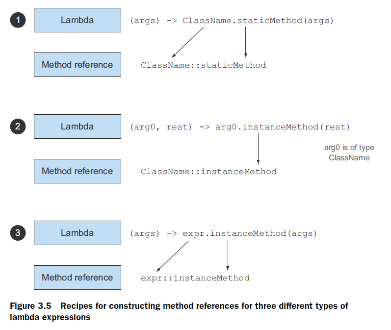

# 第三章 λ 表达式（Lambda expressions）


## 3.1. 定义

由参数、箭头、方法体构成。


## 3.2. 使用场景

需要传入函数式接口的地方（上下文）。

函数式接口：有且只有一个待实现的抽象方法的接口。

Lambda 表达式本身可以作为函数式接口的一个示例。

函数描述符（`function descriptor`）：函数式接口中的唯一抽象方法的签名。


## 3.3. Lambda 举例：环绕执行设计模式（the execute around pattern）

环绕执行设计模式：读取资源内容前，需要围绕核心操作做一些准备及收尾工作。例如：

```java
public static String processFile() throws IOException {
    try (BufferedReader br = new BufferedReader(new FileReader("data.txt"))) {
        return br.readLine();
    }
}
```

用 λ 表达式进行优化，可以将第三行的核心操作抽象为一个 λ 表达式：

```java
String result = processFile((BufferedReader br) -> br.readLine());
```

再抽象出一个对应的函数式接口：

```java
@FunctionalInterface
public interface BufferedReaderProcessor {
	String process(BufferedReader b) throws IOException;
}
```

重新改造：

```java
public static String processFile(BufferedReaderProcessor p) throws
    IOException {
    try (BufferedReader br = new BufferedReader(new FileReader("data.txt"))) {
        return p.process(br);
    }
}
// Demo application:
String oneLine = processFile((BufferedReader br) -> br.readLine());
String twoLines = processFile((BufferedReader br) -> br.readLine() + br.readLine());
```


## 3.4. 使用函数式接口

常见的 Java 8 预定义接口：`Predicate`、`Consumer`、`Function`

Java 基本类型和引用类型的装箱、拆箱转化是有代价的。装箱后的值，本质上就是把原始类型包裹起来，并保存在 **堆** 里。因此，装箱后的值需要更多的内存，并需要额外的内存搜索来获取被包裹的原始值。

为避免频繁的装箱和拆箱操作，Java 8 提供了几个特殊的接口：例如 `IntPredicate`、`DoublePredicate`。通常的规则，是在原始函数式接口前添加基本类型的前缀。差异如下：

```java
// no boxing:
IntPredicate evenNumbers = (int i) -> i % 2 == 0;
evenNumbers.test(1000);
// boxing:
Predicate<Integer> oddNumbers = (Integer i) -> i % 2 == 1;
oddNumbers.test(1000);
```

注意，特异化处理后的 `IntFunction<R>` 接口没有 `andThen`、`compose` 默认方法。

关于 λ 表达式的异常处理，有两种方式：

- 定义时类时使用带 `throws` 的抽象方法；
- 在方法体内使用 `try-catch`。


## 3.5. 类型检查、类型推断以及限制

λ 表达式的目标类型：上下文中（比如作方法参数、或作局部变量时）λ 表达式需要的类型称为目标类型（`target type`）。

同一个 λ 表达式可用于多个不同的函数式接口：

```java
Comparator<Apple> c1 = 
    (Apple a1, Apple a2) -> a1.getWeight().compareTo(a2.getWeight());
ToIntBiFunction<Apple, Apple> c2 = 
    (Apple a1, Apple a2) -> a1.getWeight().compareTo(a2.getWeight());
BiFunction<Apple, Apple, Integer> c3 = 
    (Apple a1, Apple a2) -> a1.getWeight().compareTo(a2.getWeight());
```

> **特殊的 `void` 兼容规则（Special void-compatibility rule）**
>
> 对于像 `s -> list.add(s)` 这样的 λ 表达式，其方法体为一个表达式语句的情况，则其既可以赋给一个 `Predicate<String>` 型变量（`List::and` 返回一个布尔值），也可以赋给一个 `Consumer<String>` 变量（认为返回 `void` 也是合理的）。


捕获型 λ 表达式：以下代码中的 λ 表达式捕获了局部变量 `portNumber`：

```java
int portNumber = 1337;
Runnable r = () -> System.out.println(portNumber);
```

Java 8 中的捕获型 λ 表达式对捕获的自由变量（`free variable`）有严格限制：该变量必须显式声明为 `final` 或等效的 `final`，如果变量被多次赋值则报错：

```java
int portNumber = 1337;
Runnable r = () -> System.out.println(portNumber); 
//                                    ^ Error: Local variable portNumber defined in 
//                                      an enclosing scope must be final or effectively final
portNumber = 31337;
```


> **为什么外部变量必须为 `final` 或等效 `final` ？**
>
> 原因一：实例变量存储在 **堆** 中，而局部变量则保存在 **栈** 上。假设某线程使用了一个 λ 表达式，并且该 λ 表达式可以直接访问某个局部变量 `a`，那么该线程很可能会在为 `a` 分配资源的另一线程收回 `a` 后再去访问 `a`。因此，Java 在访问这个局部自由变量时，实际上访问的是它的 **副本** 而非原始变量本身。如果局部变量仅仅赋值一次，副本和原值就始终一致，自然不会有问题；但当该变量多次赋值，副本和实际值就不一致了——因此就有了这个限制。
>
> 原因二：出于后期并行优化的考虑，该限制实际上是不推荐传统的命令式编程模式（可以任意变更局部变量的值，让 λ 表达式不再是纯函数）。

> **从闭包的角度对外部变量必须为 `final` 的再理解**
>
> 如前所述，这种限制存在的原因在于局部变量保存在 **栈** 上，并且隐式表示它们仅限于其所在线程。如果允许捕获可变的局部变量，就会引发线程
> 不安全的可能，而这是我们不想看到的（实例变量可以，因为它们保存在堆中，而堆是在线程之间共享的）。


## 3.6. 方法引用

### 1 典型方法引用

例如：

|                    λ 表达式                    |           等效的方法引用            |
| :--------------------------------------------: | :---------------------------------: |
|          `(Apple a) -> a.getWeight()`          |         `Apple::getWeight`          |
| `() -><br/>Thread.currentThread().dumpStack()` | `Thread.currentThread()::dumpStack` |
|     `(String s) -> System.out.println(s)`      |        `System.out::println`        |
|         `(str, i) -> str.substring(i)`         |         `String::substring`         |

这里最关键的一个是第四个示例：

```java
(str, i) -> str.substring(i)
// equivalent to
String::substring
```

三种典型的方法引用的诀窍：静态方法引用、第一个参数自带方法引用、外部实例的实例方法引用——



例如：

```java
List<String> str = Arrays.asList("a","b","A","B");
str.sort((s1, s2) -> s1.compareToIgnoreCase(s2));
// equivalent to
str.sort(String::compareToIgnoreCase);
```

方法引用可以被看作是 **仅调用某个特定方法的** λ 表达式的一种快捷写法。再如：

```java
Function<String, Integer> stringToInteger = (String s) -> Integer.parseInt(s);
// equivalent to
Function<String, Integer> stringToInteger = Integer::parseInt;
```

再如：

```java
BiPredicate<List<String>, String> contains = (list, element) -> list.contains(element);
// equivalent to
BiPredicate<List<String>, String> contains = List::contains;
```


### 2 构造函数方法引用

```java
// 1. No-arg constructor
Supplier<Apple> c1 = Apple::new;
Apple a1 = c1.get();
// equivalent to
Supplier<Apple> c1 = () -> new Apple();
Apple a1 = c1.get();

// 2. Unary-arg constructor
Function<Integer, Apple> c2 = Apple::new;
Apple a2 = c2.apply(110);
// equivalent to
Function<Integer, Apple> c2 = (weight) -> new Apple(weight);
Apple a2 = c2.apply(110);

// 3. Binary-arg constructor
BiFunction<String, Integer, Apple> c3 = Apple::new;
Apple c3 = c3.apply("green", 110);
// equivalent to
BiFunction<String, Integer, Apple> c3 = (color, weight) -> new Apple(color, weight);
Apple c3 = c3.apply("green", 110);
```

实际案例：

```java
static Map<String, Function<Integer, Fruit>> map = new HashMap<>();
static {
    map.put("apple", Apple::new);
    map.put("orange", Orange::new);
    // etc...
}
public static Fruit giveMeFruit(String fruit, Integer weight){
    return map.get(fruit.toLowerCase())
            .apply(weight);
}
```


## 3.7. 以 `Comparator.comparing(getter)` 为例

第一步：传统的接口实现

```java
public class AppleComparator implements Comparator<Apple> {
    public int compare(Apple a1, Apple a2){
        return a1.getWeight().compareTo(a2.getWeight());
    }
}
inventory.sort(new AppleComparator());
```

第二步：使用匿名类

```java
inventory.sort(new Comparator<Apple>() {
    public int compare(Apple a1, Apple a2){
        return a1.getWeight().compareTo(a2.getWeight());
    }
});
```

第三步：使用 λ 表达式

```java
inventory.sort((Apple a1, Apple a2) -> a1.getWeight().compareTo(a2.getWeight()));
```

第四步：使用方法引用

```java
inventory.sort(comparing(Apple::getWeight));
```


## 3.8. λ 表达式的组合

利用 `Comparator.comparing` 实现逆序、多条件排序：

```java
inventory.sort(comparing(Apple::getWeight)
               .reversed()
               .thenComparing(Apple::getCountry));
```

`Predicate` 的组合：

```java
Predicate<Apple> notRedApple = redApple.negate();
Predicate<Apple> redAndHeavyApple = redApple.and(a -> a.getWeight() > 150);
Predicate<Apple> redAndHeavyAppleOrGreen =
    	redApple.and(a -> a.getWeight() > 150)
    			.or(a -> "green".equals(a.getColor()));
```

注意：`a.or(b).and(c)` 的等效逻辑表达式为：`(a || b) && c`，即 **从左至右** 执行。


`Function` 的组合：

```java
Function<Integer, Integer> f = x -> x + 1;
Function<Integer, Integer> g = x -> x * 2;
Function<Integer, Integer> h = f.andThen(g);
int result = h.apply(1);

Function<Integer, Integer> f = x -> x + 1;
Function<Integer, Integer> g = x -> x * 2;
Function<Integer, Integer> h = f.compose(g);
int result = h.apply(1);
```

典型应用：

```java
public class Letter{
    public static String addHeader(String text){
        return "From Raoul, Mario and Alan: " + text;
    }
    public static String addFooter(String text){
        return text + " Kind regards";
    }
    public static String checkSpelling(String text){
        return text.replaceAll("labda", "lambda");
    }
}

Function<String, String> addHeader = Letter::addHeader;
Function<String, String> transformationPipeline = 
    	addHeader.andThen(Letter::checkSpelling)
    			.andThen(Letter::addFooter);
```

