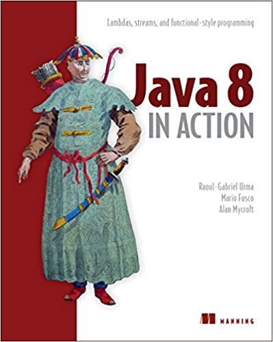

# 《Java 8 in Action》Learning Notes


## 1. Profiles




|    **Title**    |    **Java 8 in Action** [ISBN: 9781617291999]     |
| :-------------: | :-----------------------------------------------: |
|   **Author**    | **RAOUL-GABRIEL URMA, MARIO FUSCO, ALAN MYCROFT** |
| **Publication** |                **Manning, 2014.8**                |
|    **Pages**    |                      **424**                      |

> **Introduction**
>
> > **A great and concise guide to what’s new in Java8, with plenty of examples to get you going in a hurry.**
> >
> > Jason Lee, Oracle
>
> *Java 8 in Action* is a clearly written guide to the new features of Java 8. The book covers lambdas, streams, and functional-style programming. With Java 8's functional features you can now write more concise code in less time, and also automatically benefit from multicore architectures. It's time to dig in!
>
> Every new version of Java is important, but Java 8 is a game changer. *Java 8 in Action* is a clearly written guide to the new features of Java 8. It begins with a practical introduction to lambdas, using real-world Java code. Next, it covers the new Streams API and shows how you can use it to make collection-based code radically easier to understand and maintain. It also explains other major Java 8 features including `default` methods, `Optional`, `CompletableFuture`, and the new Date and Time API.
>
> ## what's inside
>
> - How to use Java 8's powerful new features
> - Writing effective multicore-ready applications
> - Refactoring, testing, and debugging
> - Adopting functional-style programming
> - Quizzes and quick-check questions
>
> ## about the reader
>
> This book is written for programmers familiar with Java and basic OO programming.
>
> ## about the authors
>
> **Raoul-Gabriel Urma** is a software engineer, speaker, trainer, and PhD candidate at the University of Cambridge. **Mario Fusco** is an engineer at Red Hat and creator of the `lambdaj` library. **Alan Mycroft** is a professor at Cambridge and cofounder of the Raspberry Pi Foundation.


## 2. Outlines

Status available：:heavy_check_mark: (Completed) | :hourglass_flowing_sand: (Working) | :no_entry: (Not Started) | :orange_book: (Finish reading)

| No.  |                        Chapter Title                         |          Status          |
| :--: | :----------------------------------------------------------: | :----------------------: |
| Ch00 |                     [Preface](./Ch00.md)                     |    :heavy_check_mark:    |
|      |                  **Part 1 -- Fundamentals**                  |                          |
| Ch01 |          [Java 8: why should you care?](./Ch01.md)           |    :heavy_check_mark:    |
| Ch02 |   [Passing code with behavior parameterization](./Ch02.md)   |    :heavy_check_mark:    |
| Ch03 |               [Lambda expressions](./Ch03.md)                |    :heavy_check_mark:    |
|      |        **Part 2 -- Functional-style data processing**        |                          |
| Ch04 |               [Introducing streams](./Ch04.md)               |    :heavy_check_mark:    |
| Ch05 |              [Working with streams](./Ch05.md)               |    :heavy_check_mark:    |
| Ch06 |          [Collecting data with streams](./Ch06.md)           |    :heavy_check_mark:    |
| Ch07 |    [Parallel data processing and performance](./Ch07.md)     |      :orange_book:       |
|      |          **Part 3 -- Effective Java 8 programming**          |                          |
| Ch08 |       [Refactoring, testing, and debugging](./Ch08.md)       |      :orange_book:       |
| Ch09 |                 [Default methods](./Ch09.md)                 | :hourglass_flowing_sand: |
| Ch10 | [Using Optional as a better alternative to null](./Ch10.md)  |        :no_entry:        |
| Ch11 | [CompletableFuture: composable asynchronous programming](./Ch11.md) |        :no_entry:        |
| Ch12 |              [New Date and Time API](./Ch12.md)              |        :no_entry:        |
|      |                 **Part 4 -- Beyond Java 8**                  |                          |
| Ch13 |              [Thinking functionally](./Ch13.md)              |        :no_entry:        |
| Ch14 |        [Functional programming techniques](./Ch14.md)        |        :no_entry:        |
| Ch15 | [Blending OOP and FP: comparing Java 8 and Scala](./Ch15.md) |        :no_entry:        |
| Ch16 |       [Conclusions and where next for Java](./Ch16.md)       |        :no_entry:        |


Powershell script for generating markdown files in batch:

```powershell
# Create 16 empty markdown files named Ch##.md:
for($i=1; $i -le 16; $i=$i+1){ New-Item -Name "Ch$('{0:d2}' -f $i).md"; }
```

